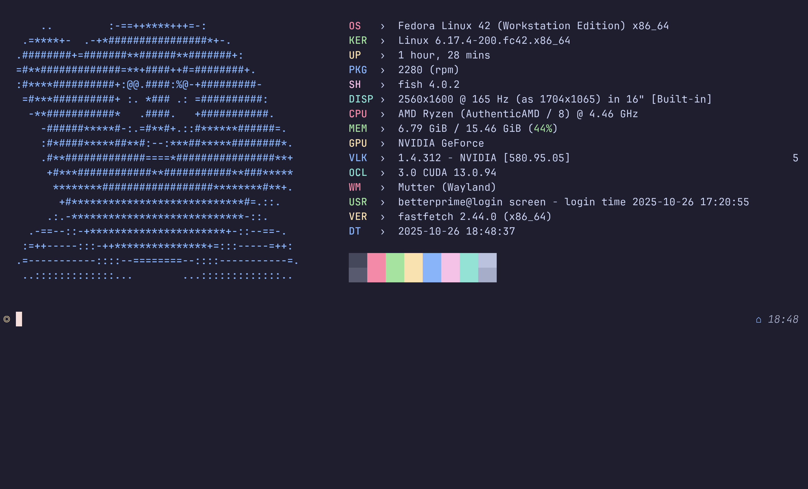

<div align="center">


# Personal Dotfiles

<div align="center">
<em>Fedora Linux 42 (Workstation Edition)</em>
</div>

</div>

---

## File Structure

```
.config/
├── fastfetch/    # System info configuration
├── fish/         # Shell configuration
└── starship.toml # Prompt configuration
.condarc          # Conda configuration
.gitconfig        # Git configuration
.wezterm.lua      # Terminal configuration
```

## Installation

**1. Clone Repository**

```bash
git clone https://github.com/GEMILUXVII/dotfiles.git ~/dotfiles
```

**2. Create Symbolic Links**

```bash
ln -sf ~/dotfiles/.config/fish ~/.config/
ln -sf ~/dotfiles/.config/starship.toml ~/.config/
ln -sf ~/dotfiles/.config/fastfetch ~/.config/
ln -sf ~/dotfiles/.wezterm.lua ~/
ln -sf ~/dotfiles/.gitconfig ~/
ln -sf ~/dotfiles/.condarc ~/
```

**3. Install Dependencies**

```bash
sudo dnf install fish fastfetch wezterm
curl -sS https://starship.rs/install.sh | sh
```

**4. Set Default Shell**

```bash
chsh -s $(which fish)
```

## Acknowledgments

The Kirby ASCII art used in fastfetch configuration was generated using [ascii-image-converter](https://github.com/TheZoraiz/ascii-image-converter) by TheZoraiz, licensed under Apache-2.0.

## License

This project is licensed under the MIT License - see the [LICENSE](LICENSE) file for details.

## Preview

<div align="center">


</div>
